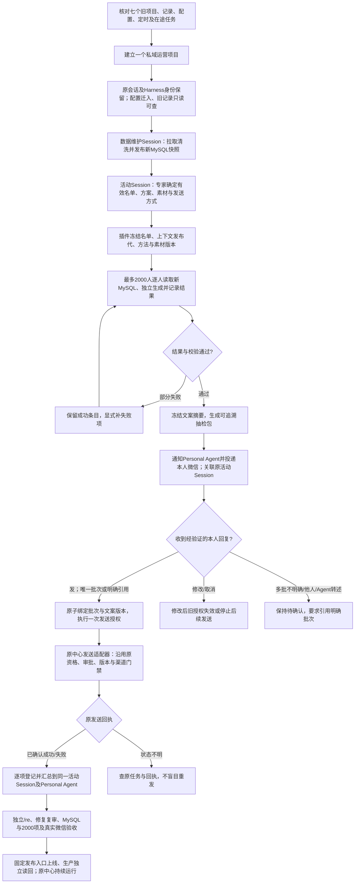

# 单项目活动闭环：业务判断流程

2026-11-05。用户已授权开发、保留记录/配置合并七项目、真实渠道验收、独立/re后上线；原上下文中心继续运行。

```mermaid
flowchart TD
 A[核对七个旧项目、记录、配置、定时及在途任务] --> B[建立一个私域运营项目]
 B --> C[原会话及Harness身份保留；配置迁入、旧记录只读可查]
 C --> D[数据维护Session：拉取清洗并发布新MySQL快照]
 D --> E[活动Session：专家确定有效名单、方案、素材与发送方式]
 E --> F[插件冻结名单、上下文发布代、方法与素材版本]
 F --> G[最多2000人逐人读取新MySQL、独立生成并记录结果]
 G --> H{结果与校验通过?}
 H -->|部分失败| I[保留成功条目，显式补失败项]
 I --> G
 H -->|通过| J[冻结文案摘要，生成可追溯抽检包]
 J --> K[通知Personal Agent并投递本人微信；关联原活动Session]
 K --> L{收到经验证的本人回复?}
 L -->|发；唯一批次或明确引用| M[原子绑定批次与文案版本，执行一次发送授权]
 L -->|修改/取消| N[修改后旧授权失效或停止后续发送]
 L -->|多批不明确/他人/Agent转述| O[保持待确认，要求引用明确批次]
 M --> P[原中心发送适配器：沿用原资格、审批、版本与渠道门禁]
 P --> Q{原发送回执}
 Q -->|已确认成功/失败| R[逐项登记并汇总到同一活动Session及Personal Agent]
 Q -->|状态不明| S[查原任务与回执，不盲目重发]
 R --> T[独立/re、修复复审、MySQL与2000项及真实微信验收]
 T --> U[固定发布入口上线、生产独立读回；原中心持续运行]
```

技术边界：工作台只增加通用组件预览/确认/通知及历史引用；活动、MySQL、批处理、发送适配与回执状态均在独立插件。普通活动Session执行专家编排；固定程序负责长任务。原会话project_id和Harness ID不改。
